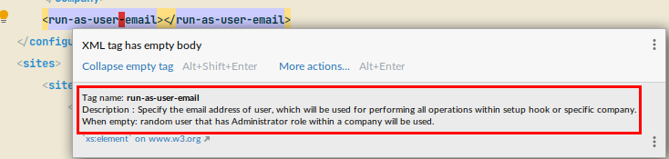

= Liferay Portal DB setup core
:liferay-version: 7.3.6
:current-db-setup-core-version: 7.3.605
:TOC:

image:https://maven-badges.herokuapp.com/maven-central/com.ableneo.liferay/com.ableneo.liferay.db.setup.core/badge.svg?color=blue[Maven Central,link=https://search.maven.org/search?q=g:com.ableneo.liferay%20AND%20a:com.ableneo.liferay.db.setup.core]
image:https://github.com/ableneo/liferay-db-setup-core/actions/workflows/build.yml/badge.svg[Build workflow status,link=https://github.com/ableneo/liferay-db-setup-core/actions/workflows/build.yml]
image:https://sonarcloud.io/api/project_badges/measure?project=liferay-db-setup-core-2_x&metric=alert_status[Quality Gate Status,link=https://sonarcloud.io/dashboard?id=liferay-db-setup-core-2_x]

Library that allows to setup a number of https://github.com/liferay[Liferay] artifacts in the DB. It uses xml and https://docs.liferay.com/portal/7.0/javadocs/portal-kernel[Liferay APIs] to add all configured artifacts.

== Usage

We recommend using Liferay's link:https://learn.liferay.com/dxp/latest/en/building-applications/data-frameworks/upgrade-processes.html[upgrade process] or control panel portlet to apply declared database changes.

=== Configuration header
All data definitions in the setup XML file are applied according to the `configuration` header. The header defines:

. the link:https://learn.liferay.com/dxp/latest/en/system-administration/configuring-liferay/virtual_instances.html[virtual instance] on which the library will modify the data.
. admin user account to be used for data modification

.Automatically selected admin user
[source, xml]
----
<?xml version="1.0" encoding="UTF-8"?>
<setup xmlns="http://www.ableneo.com/liferay/setup">
  <configuration>
    <!-- run as automatically selected admin -->

    <company>
        <companywebid>liferay.com</companywebid>
    </company>
  </configuration>
</setup>
----

.Specified admin user
[source, xml]
----
<?xml version="1.0" encoding="UTF-8"?>
<setup xmlns="http://www.ableneo.com/liferay/setup">
  <configuration>
    <run-as-user-email>admin@my.web.com</run-as-user-email>

    <company>
        <companywebid>liferay.com</companywebid>
    </company>
  </configuration>
----
=== Features

==== Service Access Policy
link:https://learn.liferay.com/dxp/latest/en/installation-and-upgrades/securing-liferay/securing-web-services/setting-service-access-policies.html#[Service access policy] is a link:https://learn.liferay.com/dxp/latest/en/installation-and-upgrades/securing-liferay/securing-web-services.html[second] from four of Liferay's API security layers. Together with _IP Permission Layer_, _Authentication and verification layer_ and _User permission layer_ is responsible for securing access to web services provided by portal instance.

If you develop new link:https://learn.liferay.com/dxp/latest/en/headless-delivery/apis-with-rest-builder.html[REST Builder] REST/GraphQL endpoint's it's a common requirement to setup an access for those API's for an unauthenticated portal user- Guest which is by default forbidden.

.Add new or update existing Service Access Policy by name
[source, xml]
----
<company-settings>
    <service-access-policies>
        <service-access-policy name="MY_ACCESS_POLICY" enabled="true" unauthenticated="true">
            <title locale="sk_SK" text="Moja pristupova politika" />
            <allowed-service-signatures> <1>
                com.liferay.headless.admin.user.internal.resource.v1_0.SiteResourceImpl#getSite
            </allowed-service-signatures>
        </service-access-policy>
    </service-access-policies>
</company>
----
<1> `allowed-service-signatures` provides the same functionality as link:https://learn.liferay.com/dxp/latest/en/installation-and-upgrades/securing-liferay/securing-web-services/setting-service-access-policies.html#creating-a-service-access-policy[_Advanced Mode_]

.Delete existing Service Access Policy by name
[source,xml]
----
<company-settings>
    <service-access-policies>
        <delete-service-access-policy name="WIZARD_GUEST_ACCESS"/>
    </service-access-policies>
</company-settings>
----
==== Permissions
Resource permissions.
[source, xml]
----
<resource-permissions>
    <resource resource-id="my.custom.resource.string">
        <actionId name="SPECIAL_PERMISSION">
            <role name="My Role"/>
            <role name="Your Role"/>
        </actionId>
    </resource>
</resource-permissions>
----
Resource permissions are set per company are verifiable with followin API call.
[source, java]
----
permissionChecker.hasPermission(
            groupId,
            "my.custom.resource.string",
            companyId,
            "SPECIAL_PERMISSION"
        );
----

Portlet permissions.
[source, xml]
----
<resource-permissions>
    <resource resource-id="myportlet_WAR_portlets">
        <actionId name="VIEW">
            <role name="User"/>
            <role name="Guest"/>
        </actionId>
    </resource>
</resource-permissions>
----
==== Roles
[source, xml]
----
<roles>
    <role name="Regular Role"/>
    <role name="Site Role" type="site"/>
<roles>
----
==== Expando attribute
Following snippet creates expando attribute `canonical-url` with permissions to view by guest user.
[source, xml]
----
<custom-fields>
    <field name="canonical-url" type="string" class-name="com.liferay.portal.kernel.model.Layout">
        <role-permission role-name="Guest" permission="view"/>
    </field>
</custom-fields>
----
==== Site
Site element must always have `site-friendly-url` attribute. Guest site is determined by `default` attribute with `true` value. All content like *pages*, *articles*, *documents* etc. is always created within a specific site.
[source, xml]
----
<sites>
    <site default="true" site-friendly-url="/guest">
    </site>
    <site default="false" site-friendly-url="/admin">
        <name>Admin</name>
        <name-translation locale="en_US" text="Admin"/>
    </site>
</sites>
----
==== Journal Article structure and template
Files `new_structure.xml` and `new_structure_template.ftl` are deployed as a part of a module that is using the `db-setup-core` library and reside in it's classpath.
[source, xml]
----

    <site site-friendly-url="/admin">
      <article-structure key="NEW-STRUCTURE-KEY"
                         path="new_structure.xml"
                         name="New Structure"/>

      <article-template key="NEW-STRUCTURE-TEMPLATE-KEY"
                        path="new_structure_template.ftl"
                        article-structure-key="NEW-STRUCTURE-KEY" name="New Structure Template" cacheable="true"/>

      <name>Admin</name>
    </site>
----
==== Articles
File `artcle.xml` is deployed as a part of a module that is using the `db-setup-core` library and reside in it's classpath.
[source, xml]
----
<sites>
    <site>
        <article
            title="Article Title"
            path="article.xml"
            article-structure-key="NEW-STRUCTURE-KEY"
            article-template-key="NEW-STRUCTURE-TEMPLATE-KEY"
            articleId="ARTICLE_ID">
            <tag name="product" />
        </article>
    </site>
</sites>
----
==== Document
Document's file itself is determined by `file-system-name` attribute which defines resource on classpath.
[source, xml]
----
<sites>
    <site>
        <document file-system-name="image.svg"
                  document-folder-name="/Images"
                  document-filename="image.svg"
                  document-title="image.svg"/>
    </site>
</sites>
----

=== Setup guide

. Install the `com.ableneo.liferay.db.setup.core-{current-db-setup-core-version}.jar` bundle in `${liferay.home}/osgi/modules`
. Prepare your own bundle that uses the library as a `provided`/`compileOnly` dependency. For example:
+
.build.gradle
[subs=attributes+]
```groovy
dependencies {
    compileOnly 'com.ableneo.liferay:com.ableneo.liferay.db.setup.core:{current-db-setup-core-version}'
}
```
+
.pom.xml
[subs=attributes+]
```xml
<dependency>
    <groupId>com.ableneo.liferay</groupId>
    <artifactId>com.ableneo.liferay.db.setup.core</artifactId>
    <version>{current-db-setup-core-version}</version>
    <scope>provided</scope>
</dependency>
```

. Prepare xml data configuration. Documentation sits directly in the link:src/main/resources/setup_definition.xsd[setup_definition.xsd] file.
+
.Example documentation

+
.Example configuration: setup.xml
[source,xml]
----
<?xml version="1.0" encoding="UTF-8" ?>
<setup xmlns="http://www.ableneo.com/liferay/setup">
    <configuration> 
        <!-- uses random administrator account for the setup in the company, run-as-user-email tag allows to specify particular admin account to be used for the setup -->
        <company> 
            <companyid>20101</companyid> <!-- companywebid can be used alternatively -->
        </company>
    </configuration>
    <sites>
        <site> <!-- Guest by default -->
            <vocabulary name="Some categories" uuid="602f55b6-6021-455e-8d6d-696cc25daa91">
                <title-translation locale="de_DE" text="Einige Kategorien"/>
                <category name="Other categories" uuid="867b33df-2465-4a81-9945-88159c604589">
                    <title-translation locale="de_DE" text="Andere Kategorien"/>
                    <category name="New category" uuid="5fb4308e-bd21-4cf4-bdc5-3557508ffe4a">
                        <title-translation locale="de_DE" text="Neue Kategorie"/>
                    </category>
                </category>
            </vocabulary>
        </site>
    </sites>
</setup>
----
. Load the XML setup file and run `setup` method on it:
+
[source, java]
----
URL resource = Thread.currentThread().getContextClassLoader().getResource(path);
InputStream setupFile = Objects.requireNonNull(resource, "XML Liferay DB setup file not found in classpath.").openStream();
Setup setup = MarshallUtil.unmarshall(setupFile);
boolean setupSuccess = LiferaySetup.setup(setup);
----


=== Liferay Portal requirements

The code is compatible with *Liferay Portal {liferay-version}*. Other versions that have been or are supported:

. https://github.com/ableneo/liferay-db-setup-core/tree/7.3.5[Liferay Portal EE/CE 7.3.5]
. https://github.com/ableneo/liferay-db-setup-core/tree/b0d4e1d602015b704218c5511277bc87dc7eb9c7[Liferay Portal EE/CE 7.1.2]
. https://github.com/ableneo/liferay-db-setup-core/tree/1.x[Liferay Portal EE/CE 6.2.5 and higher]

== Roadmap

* more tests
* project integration with lundegaard fork: https://github.com/lundegaard/liferay-db-setup-core, until than changes and fixes from lundegaard fork will be ported to the library

== Motivation

We use https://github.com/liferay[Liferay] as an application building platform.

Portlets, content and permissions, in short- *data* serve as a building block of a web application with consistent portal UX. In the use case the *data* play important role in application building, greatly influencing UX.

By storing the application *data* as XML declaration we enable developers to version and progress *data* development as if it was a *code*. All standard development practices like versioning, code review, building and deployment can be applied to the Liferay *data as code*.

== Contributing

Want/need to hack on db-setup-core? See our link:CONTRIBUTING.adoc[super short contributing guide] for information on building, testing and contributing changes.

They are probably not perfect, please let me know if anything feels wrong or incomplete.


== Changelog

=== Version 7.3.605
==== Features & bug fixes
* fixed bug when handling multiline link:https://learn.liferay.com/dxp/latest/en/installation-and-upgrades/securing-liferay/securing-web-services/setting-service-access-policies.html[service access policy]

=== Version 7.3.604
==== Features & bug fixes
* added an ability to create/update/delete link:https://learn.liferay.com/dxp/latest/en/installation-and-upgrades/securing-liferay/securing-web-services/setting-service-access-policies.html[Service Access Policies]

==== Refactorings & project changes
* refactored common mock setup into a separate class

=== Version 7.3.603
==== Features & bug fixes
* fixed setup for multiple companies/groups

==== Refactorings & project changes
* upgraded test harness to latest mockito, added basic tests for multiple company/groups setup execution
* fixed SonarCloud scan integration with GitHub actions, TODO: pull request decoration

=== Version 7.3.602
==== Features & bug fixes
* fixed configuration related resource reading, library can read e.g. article files from caller bundle, credit goes to Milan Kuljovsky- thank you!
* article-structure-key and article-template-key article element attributes are required as there are no defaults for those values

=== Version 7.3.601
==== Features & bug fixes
* target Liferay Portal version is still minimum 7.3.6 (GA7)
* fix: add individual resource for permissions setup in case there are declared not for portlet but a `model-resource`, allows to use `hasUserPermission` method for the custom resource id string and a `primKey = companyId`
+
.Fixed configuration
[source, xml]
----
    <resource-permissions>
        <resource resource-id="custom.resource.id-not.a.portlet.id">
            <actionId name="SOME_PERMISSION">
                <role name="Some Portal Role"/>
----

==== Refactorings & project changes
* version changed from 4 to 3 numbers, build version will increment every time there is a new feature or bugfix
* improved docs

=== Version 7.3.6.0

==== Features & bug fixes
* Bumped target Liferay Portal version to minimum 7.3.6 ga7.
* Improved category/vocabulary idempotency, it's possible to update categories and vocabularies with optional uuid, before categories/vocabularies were identified only by name. That allows to update a category name which wasn't possible before.
* Improved categories/vocabulary updates performance, update is only issued if anything in the definition differs compared to the data in the DB.
* Category by_name search is scoped only to a particular vocabulary.
* Added property element in categories that allows to define AssetCategoryProperty. These are identified by a key. 
+
TIP: TODO: deletion of existing property.

==== Refactorings & project changes
* divided xsd to "elements" and "types" parts, replaced many element references with types which improves naming flexibility
* every xsd type follows is camel cased and suffixed with word: Type, e.g. UuidType
* simplified dependency management with `release.portal.bom`
* removed `shade` maven plugin as portal exports `com.liferay.portlet.asset.util` package already in `org.eclipse.osgi_3.13.0.LIFERAY-PATCHED-11` bundle

=== Version 7.3.5.0

==== Features & bug fixes

* OSGI descriptors in JAR, the bundle can be deployed and work as a standalone Liferay 7.x bundle

* instance import feature added, credit goes to https://github.com/bimki[@bimki] - thank you!
* portal properties feature added, credit goes to https://github.com/fabalint[@fabalint] - thank you!
* new helper methods to run the setup (ported from 1.x branch):
** `com.ableneo.liferay.portal.setup.LiferaySetup#setup(java.io.InputStream)`
** `com.ableneo.liferay.portal.setup.LiferaySetup#setup(java.io.File)`
* fixed categorization idempotency (vocabulary and category name handling)
* fixed language handling for groups

==== Refactorings & project changes

* improved javadoc in entrypoint `com.ableneo.liferay.portal.setup.LiferaySetup` class
* upped dependencies to https://liferay.dev/blogs/-/blogs/liferay-portal-7-3-ce-ga6-release[Liferay 7.3.5], credit goes to https://github.com/fabalint[@fabalint] - thank you!
* changed versioning so that major.minor.patch version reflects target platform, build version will be used to track changes in the library
* documentation format conversion from markdown to https://asciidoc.org/[aciidoc]
* added slf4j and changed logger in few classes for more ergonomic log message interpolation (Liferay 7.x provides slf4j by default)
* added prettier formatter to the project
* added build environment setup automation with <<_automated_local_build_environment_setup_with_nix,nix>>

=== Version 2.2.0-SNAPSHOT

==== Features & bug fixes

* it's possible to use more than one company id per configuration file, the configuration will be applied to all listed companies
* tag names in configuration follow unified naming convention: word-word
* run-as-user renamed to run-as-user-email to be explicit about expected value
* added missing documentation to few xml elements
* setup xsd provides a version attribute

==== Refactorings & project changes

* configured sonar analysis on each commit
* configured maven test / coverage runner
* maven project structure has changed to single-module
* companyId, groupId and runAsUserId are set in Setup class and propagated to all involved Utils with SetupConfigurationThreadLocal context class
* improved MarshallUtil performance
* introduced unit tests
* most of the problems reported by sonar are fixed
* improved logging

=== Version 2.1.4

==== Features & bug fixes

* Added resource class name when creating ADT
* Fix user expando assignement
* Allow add categories and summaries to articles
