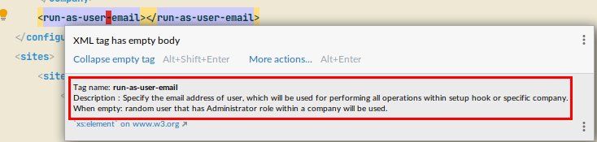

= Liferay Portal DB setup core
:liferay-version: 7.4.3.125
:current-db-setup-core-version: 7.4.3125.2
:TOC:

image:https://maven-badges.herokuapp.com/maven-central/com.ableneo.liferay/com.ableneo.liferay.db.setup.core/badge.svg?color=blue[Maven Central,link=https://search.maven.org/search?q=g:com.ableneo.liferay%20AND%20a:com.ableneo.liferay.db.setup.core]
image:https://github.com/ableneo/liferay-db-setup-core/actions/workflows/build.yml/badge.svg[Build workflow status,link=https://github.com/ableneo/liferay-db-setup-core/actions/workflows/build.yml]
image:https://sonarcloud.io/api/project_badges/measure?project=ableneo_liferay-db-setup-core&metric=alert_status[Quality Gate Status,link=https://sonarcloud.io/dashboard?id=ableneo_liferay-db-setup-core]

Library that allows to automate https://github.com/liferay[Liferay] data setup. It uses XML configuration input to add the data.

== Compatibility matrix

|===
|Liferay Portal version|DB setup core version

|{liferay-version} |{current-db-setup-core-version} link:https://github.com/ableneo/liferay-db-setup-core/tree/master[source]
|7.4.3.125 | 7.4.3125.2 link:https://central.sonatype.com/artifact/com.ableneo.liferay/com.ableneo.liferay.db.setup.core/7.4.3125.2[jar] link:https://github.com/ableneo/liferay-db-setup-core/tree/7.4.3125.2[source]
|7.4.3.86 | 7.4.3861 link:https://central.sonatype.com/artifact/com.ableneo.liferay/com.ableneo.liferay.db.setup.core/7.4.3861[jar] link:https://github.com/ableneo/liferay-db-setup-core/tree/7.4.3861[source]
|7.3.6 | 7.3.605 link:https://central.sonatype.com/artifact/com.ableneo.liferay/com.ableneo.liferay.db.setup.core/7.3.605[jar] link:https://github.com/ableneo/liferay-db-setup-core/tree/7.3.6[source]
|7.3.6 | 7.3.605 link:https://central.sonatype.com/artifact/com.ableneo.liferay/com.ableneo.liferay.db.setup.core/7.3.605[jar] link:https://github.com/ableneo/liferay-db-setup-core/tree/7.3.6[source]
|7.3.5 | 7.3.5 link:https://github.com/ableneo/liferay-db-setup-core/tree/7.3.5[source]
|7.1.2 | link:https://github.com/ableneo/liferay-db-setup-core/tree/b0d4e1d602015b704218c5511277bc87dc7eb9c7[source]
|6.2.5 | link:https://github.com/ableneo/liferay-db-setup-core/tree/1.x[source]

|===


== Usage

. Install the `com.ableneo.liferay.db.setup.core-{current-db-setup-core-version}.jar` bundle in `${liferay.home}/osgi/modules`
. Prepare your own bundle that uses the library as a `provided`/`compileOnly` dependency. For example:
+
.build.gradle
[subs=attributes+]
```groovy
dependencies {
    compileOnly 'com.ableneo.liferay:com.ableneo.liferay.db.setup.core:{current-db-setup-core-version}'
}
```
+
.pom.xml
[subs=attributes+]
```xml
<dependency>
    <groupId>com.ableneo.liferay</groupId>
    <artifactId>com.ableneo.liferay.db.setup.core</artifactId>
    <version>{current-db-setup-core-version}</version>
    <scope>provided</scope>
</dependency>
```

. Prepare xml data configuration. Documentation sits directly in the link:src/main/resources/setup_definition.xsd[setup_definition.xsd] file.
+
.Example documentation

+
.Example configuration: setup.xml
[source,xml]
----
<?xml version="1.0" encoding="UTF-8" ?>
<setup xmlns="http://www.ableneo.com/liferay/setup">
    <configuration> 
        <!-- uses random administrator account for the setup in the company, run-as-user-email tag allows to specify particular admin account to be used for the setup -->
        <company> 
            <companyid>20101</companyid> <!-- companywebid can be used alternatively -->
        </company>
    </configuration>
    <sites>
        <site> <!-- Guest by default -->
            <vocabulary name="Some categories" uuid="602f55b6-6021-455e-8d6d-696cc25daa91">
                <title-translation locale="de_DE" text="Einige Kategorien"/>
                <category name="Other categories" uuid="867b33df-2465-4a81-9945-88159c604589">
                    <title-translation locale="de_DE" text="Andere Kategorien"/>
                    <category name="New category" uuid="5fb4308e-bd21-4cf4-bdc5-3557508ffe4a">
                        <title-translation locale="de_DE" text="Neue Kategorie"/>
                    </category>
                </category>
            </vocabulary>
        </site>
    </sites>
</setup>
----
. Load the XML setup file and run `setup` method on it:
+
[source, java]
----
URL resource = Thread.currentThread().getContextClassLoader().getResource(path);
InputStream setupFile = Objects.requireNonNull(resource, "XML Liferay DB setup file not found in classpath.").openStream();
Setup setup = MarshallUtil.unmarshall(setupFile);
boolean setupSuccess = LiferaySetup.setup(setup);
----

==== Example project

Used primarily for integration testing but may be a good start for your application: link:./com.ableneo.liferay.portal.setup.example/[com.ableneo.liferay.portal.setup.example]

=== How to bundle and execute DB changes for Liferay portal

Bundling XML descriptors and code that will execute them in bundle separate to the 

.Directory layout in bundle project

.Usage in activator class
[source, java]
----
----

=== Configuration header
All data definitions in the setup XML file are applied according to the `configuration` header. The header defines:

. the link:https://learn.liferay.com/dxp/latest/en/system-administration/configuring-liferay/virtual_instances.html[virtual instance] on which the library will modify the data.
. admin user account to be used for data modification

.Automatically selected admin user
[source, xml]
----
<?xml version="1.0" encoding="UTF-8"?>
<setup xmlns="http://www.ableneo.com/liferay/setup">
  <configuration>
    <!-- run as automatically selected admin -->

    <company>
        <companywebid>liferay.com</companywebid>
    </company>
  </configuration>
</setup>
----

.Specified admin user
[source, xml]
----
<?xml version="1.0" encoding="UTF-8"?>
<setup xmlns="http://www.ableneo.com/liferay/setup">
  <configuration>
    <run-as-user-email>admin@my.web.com</run-as-user-email>

    <company>
        <companywebid>liferay.com</companywebid>
    </company>
  </configuration>
</setup>
----
=== Features

==== Service Access Policy
link:https://learn.liferay.com/dxp/latest/en/installation-and-upgrades/securing-liferay/securing-web-services/setting-service-access-policies.html#[Service access policy] is a link:https://learn.liferay.com/dxp/latest/en/installation-and-upgrades/securing-liferay/securing-web-services.html[second] from four of Liferay's API security layers. Together with _IP Permission Layer_, _Authentication and verification layer_ and _User permission layer_ is responsible for securing access to web services provided by portal instance.

If you develop new link:https://learn.liferay.com/dxp/latest/en/headless-delivery/apis-with-rest-builder.html[REST Builder] REST/GraphQL endpoint's it's a common requirement to setup an access for those API's for an unauthenticated portal user- Guest which is by default forbidden.

.Add new or update existing Service Access Policy by name
[source, xml]
----
<?xml version="1.0" encoding="UTF-8"?>
<setup xmlns="http://www.ableneo.com/liferay/setup">
<company-settings>
    <service-access-policies>
        <service-access-policy name="MY_ACCESS_POLICY" enabled="true" unauthenticated="true">
            <title locale="sk_SK" text="Moja pristupova politika" />
            <allowed-service-signatures> <1>
                com.liferay.headless.admin.user.internal.resource.v1_0.SiteResourceImpl#getSite
            </allowed-service-signatures>
        </service-access-policy>
    </service-access-policies>
</company-settings>
</setup>
----
<1> `allowed-service-signatures` provides the same functionality as link:https://learn.liferay.com/dxp/latest/en/installation-and-upgrades/securing-liferay/securing-web-services/setting-service-access-policies.html#creating-a-service-access-policy[_Advanced Mode_]

.Delete existing Service Access Policy by name
[source,xml]
----
<?xml version="1.0" encoding="UTF-8"?>
<setup xmlns="http://www.ableneo.com/liferay/setup">
<company-settings>
    <service-access-policies>
        <delete-service-access-policy name="WIZARD_GUEST_ACCESS"/>
    </service-access-policies>
</company-settings>
</setup>
----
==== Permissions
Resource permissions.
[source, xml]
----
<?xml version="1.0" encoding="UTF-8"?>
<setup xmlns="http://www.ableneo.com/liferay/setup">
<resource-permissions>
    <resource resource-id="my.custom.resource.string">
        <actionId name="SPECIAL_PERMISSION">
            <role name="My Role"/>
            <role name="Your Role"/>
        </actionId>
    </resource>
</resource-permissions>
</setup>
----
Resource permissions are set per company are verifiable with followin API call.
[source, java]
----
permissionChecker.hasPermission(
            groupId,
            "my.custom.resource.string",
            companyId,
            "SPECIAL_PERMISSION"
        );
----

Portlet permissions.
[source, xml]
----
<?xml version="1.0" encoding="UTF-8"?>
<setup xmlns="http://www.ableneo.com/liferay/setup">
<resource-permissions>
    <resource resource-id="myportlet_WAR_portlets">
        <actionId name="VIEW">
            <role name="User"/>
            <role name="Guest"/>
        </actionId>
    </resource>
</resource-permissions>
</setup>
----
==== Roles
[source, xml]
----
<?xml version="1.0" encoding="UTF-8"?>
<setup xmlns="http://www.ableneo.com/liferay/setup">
<roles>
    <role name="Regular Role"/>
    <role name="Site Role" type="site"/>
</roles>
</setup>
----
==== Expando attribute
Following snippet creates expando attribute `canonical-url` with permissions to view by guest user.
[source, xml]
----
<?xml version="1.0" encoding="UTF-8"?>
<setup xmlns="http://www.ableneo.com/liferay/setup">
<custom-fields>
    <field name="canonical-url" type="string" class-name="com.liferay.portal.kernel.model.Layout">
        <role-permission role-name="Guest" permission="view"/>
    </field>
</custom-fields>
</setup>
----
==== Site selection
All content like *pages*, *articles*, *documents* etc. is always created within a specific site. You can create new or refer to existing site.  

[source, xml]
----
<?xml version="1.0" encoding="UTF-8"?>
<setup xmlns="http://www.ableneo.com/liferay/setup">
<sites>
    <site default="true">
        <!-- default company site -->
    </site>
    <site global="true">
        <!-- global company site -->
    </site>
    <site default="false" site-friendly-url="/admin" name="Admin">
        <!-- specific site -->
        <name-translation locale="en_US" text="Admin"/>
    </site>
</sites>
</setup>
----
==== Page order in the navigation menu
Use the optional `page-sequence` attribute of a `page` element to control where the page appears in the navigation menu. `0` is the first (top/leftmost) position, `1` the second, and so on. Pages compete for position only with their sibling pages within one page set (`public-pages` or `private-pages`).

How to use it:

. Number the pages you care about with contiguous values starting at `0`. The order in which the pages are declared in the XML does not matter, only `page-sequence` does.
. Leave the attribute out on pages whose position should not change - a page without `page-sequence` is never moved by the setup, so an ordering done manually in the portal is not overwritten on the next setup run. Such a page can still be pushed one position back by a configured page that moves in front of it, because Liferay keeps the priorities of a page set contiguous.

The following example builds a menu in the order: Home, Products, News, Contact.

[source, xml]
----
<?xml version="1.0" encoding="UTF-8"?>
<setup xmlns="http://www.ableneo.com/liferay/setup">
<sites>
    <site default="false" site-friendly-url="/corporate" name="Corporate">
        <public-pages language-id="en_US">
            <!-- declared out of order on purpose: page-sequence, not document order, decides -->
            <page name="News" friendly-url="/news" page-sequence="2"/>
            <page name="Home" friendly-url="/home" page-sequence="0"/>
            <page name="Products" friendly-url="/products" page-sequence="1"/>
            <!-- no page-sequence: Contact keeps the position it already has in the portal -->
            <page name="Contact" friendly-url="/contact"/>
        </public-pages>
    </site>
</sites>
</setup>
----

Technically the value is mapped directly to the Liferay `priority` attribute of the layout. Liferay re-sequences the layout priorities of the sibling pages on every change, so an out of range value (e.g. `99`) does not create a gap, it simply moves the page to the end of the list.

Because `LayoutLocalServiceUtil.updatePriority` moves a page to a position rather than assigning a number to it, every move shifts the siblings that already sit at or after that position. The setup therefore creates or updates all pages of one page set first and only then applies the sequences, in ascending order. Doing it the other way around, one page at a time in document order, degenerates into an insertion sort that yields the configured order only for some declaration orders.

===== Sites linked to a Site Template
In a site linked to a Site Template with propagation enabled, pages propagated from the template always sort before pages defined locally. Liferay adds a priority buffer of 1,000,000 to the pages created locally in such a site, so `page-sequence` orders the configured pages relative to each other within the local band and the `Layout.priority` stored in the database differs from the configured value (configured `2` can be stored as `1000002`).

Pages linked to a layout set prototype are treated by Liferay as not sortable and the portal can reject the requested priority. Such a failure is logged and the setup continues with the remaining pages.

==== Journal Article structure and template
Files `new_structure.xml` and `new_structure_template.ftl` are deployed as a part of a module that is using the `db-setup-core` library and reside in it's classpath.
[source, xml]
----
<?xml version="1.0" encoding="UTF-8"?>
<setup xmlns="http://www.ableneo.com/liferay/setup">

<sites>
    <site site-friendly-url="/admin" name="Admin">
      <article-structure key="NEW-STRUCTURE-KEY"
                         path="new_structure.xml"
                         name="New Structure"/>

      <article-template key="NEW-STRUCTURE-TEMPLATE-KEY"
                        path="new_structure_template.ftl"
                        article-structure-key="NEW-STRUCTURE-KEY" name="New Structure Template" cacheable="true"/>

    </site>
</sites>
</setup>
----
==== Articles
File `artcle.xml` is deployed as a part of a module that is using the `db-setup-core` library and reside in it's classpath.
[source, xml]
----
<?xml version="1.0" encoding="UTF-8"?>
<setup xmlns="http://www.ableneo.com/liferay/setup">

<sites>
    <site global="true">
        <article
            title="Article Title"
            path="article.xml"
            article-structure-key="NEW-STRUCTURE-KEY"
            article-template-key="NEW-STRUCTURE-TEMPLATE-KEY"
            articleId="ARTICLE_ID">
            <tag name="product" />
        </article>
    </site>
</sites>
</setup>
----
==== Document
Document's file itself is determined by `file-system-name` attribute which defines resource on classpath.
[source, xml]
----
<?xml version="1.0" encoding="UTF-8"?>
<setup xmlns="http://www.ableneo.com/liferay/setup">

<sites>
    <site name="Guest">
        <document file-system-name="image.svg"
                  document-folder-name="/Images"
                  document-filename="image.svg"
                  document-title="image.svg"/>
    </site>
</sites>
</setup>
----

=== Liferay Portal requirements

The code is compatible with *Liferay Portal {liferay-version}*. Other versions that have been or are supported:

. https://github.com/ableneo/liferay-db-setup-core/tree/7.3.6[Liferay Portal EE/CE 7.3.6]
. https://github.com/ableneo/liferay-db-setup-core/tree/7.3.5[Liferay Portal EE/CE 7.3.5]
. https://github.com/ableneo/liferay-db-setup-core/tree/b0d4e1d602015b704218c5511277bc87dc7eb9c7[Liferay Portal EE/CE 7.1.2]
. https://github.com/ableneo/liferay-db-setup-core/tree/1.x[Liferay Portal EE/CE 6.2.5 and higher]

== Roadmap

* integration with link:https://liferay.dev/es/blogs/-/blogs/site-initializers-101[Site Initializers]
* more tests
* project integration with lundegaard fork: https://github.com/lundegaard/liferay-db-setup-core, until than changes and fixes from lundegaard fork will be ported to the library

== Motivation

We use https://github.com/liferay[Liferay] as an application building platform.

Portlets, content and permissions, in short- *data* serve as a building block of a web application with consistent portal UX. In the use case the *data* play important role in application building, greatly influencing UX.

By storing the application *data* as XML declaration we enable developers to version and progress *data* development as if it was a *code*. All standard development practices like versioning, code review, building and deployment can be applied to the Liferay *data as code*.

== Contributing

Want/need to hack on db-setup-core? See our link:CONTRIBUTING.adoc[super short contributing guide] for information on building, testing and contributing changes.

They are probably not perfect, please let me know if anything feels wrong or incomplete.


== Changelog

=== Version 7.4.3125.3
==== Features & bug fixes
* added optional `page-sequence` page attribute that controls the position of a page in the navigation menu, the value maps directly to the Liferay layout priority <<_page_order_in_the_navigation_menu>>

==== Refactorings & project changes
* migrated remaining classes from Liferay kernel Log to SLF4J

=== Version 7.4.3125.2
==== Bug fixe
* fixed SetupArticles bug so it works creating new article structures, simplified the code

=== Version 7.4.3125.1
==== Features & bug fixes
* fixed SetupArticles bug so it works with data definition json export

=== Version 7.4.3125.0

==== Features & bug fixes
* switched to JDK21
* api compatible with Liferay 7.4.3.125
* fixed category import (updating parent)
* fixed working with global/default sites <<_site_selection>>
* updated docs

=== Version 7.4.3860

==== Features & bug fixes
* switched to JDK11
* upgraded and tested all features in link:./com.ableneo.liferay.site.example/src/main/resources/setup-ableneo-site.xml[example setup] with Liferay Portal 7.4.3.86
* attached two tests from lundegaard fork, credit goes to link:https://github.com/Jandys[Jakub Jandak], thank you!

==== Refactorings & project changes
* improved documentation

=== Version 7.3.605
==== Features & bug fixes
* fixed bug when handling multiline link:https://learn.liferay.com/dxp/latest/en/installation-and-upgrades/securing-liferay/securing-web-services/setting-service-access-policies.html[service access policy]

=== Version 7.3.604
==== Features & bug fixes
* added an ability to create/update/delete link:https://learn.liferay.com/dxp/latest/en/installation-and-upgrades/securing-liferay/securing-web-services/setting-service-access-policies.html[Service Access Policies]

==== Refactorings & project changes
* refactored common mock setup into a separate class

=== Version 7.3.603
==== Features & bug fixes
* fixed setup for multiple companies/groups

==== Refactorings & project changes
* upgraded test harness to latest mockito, added basic tests for multiple company/groups setup execution
* fixed SonarCloud scan integration with GitHub actions, TODO: pull request decoration

=== Version 7.3.602
==== Features & bug fixes
* fixed configuration related resource reading, library can read e.g. article files from caller bundle, credit goes to Milan Kuljovsky- thank you!
* article-structure-key and article-template-key article element attributes are required as there are no defaults for those values

=== Version 7.3.601
==== Features & bug fixes
* target Liferay Portal version is still minimum 7.3.6 (GA7)
* fix: add individual resource for permissions setup in case there are declared not for portlet but a `model-resource`, allows to use `hasUserPermission` method for the custom resource id string and a `primKey = companyId`
+
.Fixed configuration
[source, xml]
----
<?xml version="1.0" encoding="UTF-8"?>
<setup xmlns="http://www.ableneo.com/liferay/setup">

    <resource-permissions>
        <resource resource-id="custom.resource.id-not.a.portlet.id">
            <actionId name="SOME_PERMISSION">
                <role name="Some Portal Role"/>
            </actionId>
        </resource>
    </resource-permissions>
</setup>
----

==== Refactorings & project changes
* version changed from 4 to 3 numbers, build version will increment every time there is a new feature or bugfix
* improved docs

=== Version 7.3.6.0

==== Features & bug fixes
* Bumped target Liferay Portal version to minimum 7.3.6 ga7.
* Improved category/vocabulary idempotency, it's possible to update categories and vocabularies with optional uuid, before categories/vocabularies were identified only by name. That allows to update a category name which wasn't possible before.
* Improved categories/vocabulary updates performance, update is only issued if anything in the definition differs compared to the data in the DB.
* Category by_name search is scoped only to a particular vocabulary.
* Added property element in categories that allows to define AssetCategoryProperty. These are identified by a key. 
+
TIP: TODO: deletion of existing property.

==== Refactorings & project changes
* divided xsd to "elements" and "types" parts, replaced many element references with types which improves naming flexibility
* every xsd type follows is camel cased and suffixed with word: Type, e.g. UuidType
* simplified dependency management with `release.portal.bom`
* removed `shade` maven plugin as portal exports `com.liferay.portlet.asset.util` package already in `org.eclipse.osgi_3.13.0.LIFERAY-PATCHED-11` bundle

=== Version 7.3.5.0

==== Features & bug fixes

* OSGI descriptors in JAR, the bundle can be deployed and work as a standalone Liferay 7.x bundle

* instance import feature added, credit goes to https://github.com/bimki[@bimki] - thank you!
* portal properties feature added, credit goes to https://github.com/fabalint[@fabalint] - thank you!
* new helper methods to run the setup (ported from 1.x branch):
** `com.ableneo.liferay.portal.setup.LiferaySetup#setup(java.io.InputStream)`
** `com.ableneo.liferay.portal.setup.LiferaySetup#setup(java.io.File)`
* fixed categorization idempotency (vocabulary and category name handling)
* fixed language handling for groups

==== Refactorings & project changes

* improved javadoc in entrypoint `com.ableneo.liferay.portal.setup.LiferaySetup` class
* upped dependencies to https://liferay.dev/blogs/-/blogs/liferay-portal-7-3-ce-ga6-release[Liferay 7.3.5], credit goes to https://github.com/fabalint[@fabalint] - thank you!
* changed versioning so that major.minor.patch version reflects target platform, build version will be used to track changes in the library
* documentation format conversion from markdown to https://asciidoc.org/[aciidoc]
* added slf4j and changed logger in few classes for more ergonomic log message interpolation (Liferay 7.x provides slf4j by default)
* added prettier formatter to the project
* added build environment setup automation with <<_automated_local_build_environment_setup_with_nix,nix>>

=== Version 2.2.0-SNAPSHOT

==== Features & bug fixes

* it's possible to use more than one company id per configuration file, the configuration will be applied to all listed companies
* tag names in configuration follow unified naming convention: word-word
* run-as-user renamed to run-as-user-email to be explicit about expected value
* added missing documentation to few xml elements
* setup xsd provides a version attribute

==== Refactorings & project changes

* configured sonar analysis on each commit
* configured maven test / coverage runner
* maven project structure has changed to single-module
* companyId, groupId and runAsUserId are set in Setup class and propagated to all involved Utils with SetupConfigurationThreadLocal context class
* improved MarshallUtil performance
* introduced unit tests
* most of the problems reported by sonar are fixed
* improved logging

=== Version 2.1.4

==== Features & bug fixes

* Added resource class name when creating ADT
* Fix user expando assignement
* Allow add categories and summaries to articles
